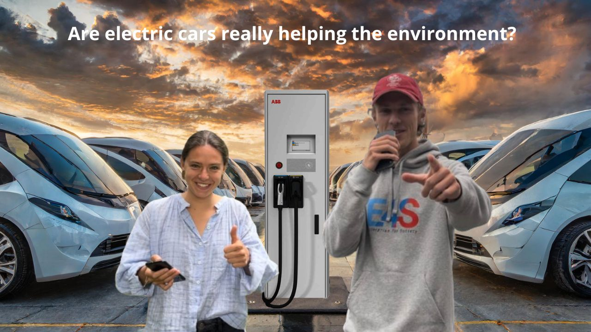

# DSML
Lesgooo 🔥🚀🚀

# [Link to YouTube video! 📽 (handle with care <3)](https://youtu.be/NdGiVm-JP9c)

# Electric Vehicles and Air Quality Analysis

## 🧭 Table of Contents

- [📌 Project Overview](#project-overview)
- [🎯 Objectives](#objectives)
- [📁 Folder Structure](#folder-structure)
- [⚙️ Setup Instructions](#setup-instructions)
- [🖥️ Streamlit Dashboard Overview](#️-streamlit-dashboard-overview)
- [🔍 Project Flow](#-project-flow)
- [📊 Exploratory Data Analysis (EDA)](#-exploratory-data-analysis-eda)
- [🔍 Model Setup & Main Takeways](#-model-setup--main-takeways)
- [📈 Analysis](#-analysis)
- [🧩 Discussion & Limitations](#-discussion--limitations)
- [✅ Conclusions](#-conclusions)

## Project Overview
Hi an welcome to our DSML final project! We're excited to share our work with you and hope you find our repository as interesting as we do! We had A LOT of fun with this project and hope the video reflects this! We learned so much about working in Git, Streamlit and troubleshooting. 

This project investigates the impact of electric vehicle (EV) adoption on air quality, focusing primarily on Switzerland. Through data analysis and statistical evaluation, we aim to determine whether there is measurable evidence supporting the claim that EVs significantly improve air quality.

## Objectives
- Collect and analyze historical data on EV sales and air quality metrics.
- Perform trend analysis to examine the relationship between EV adoption and air quality indicators (e.g., PM2.5, NO₂, CO₂).
- Use statistical and machine learning techniques to evaluate the significance of observed changes.
- Present findings through a Streamlit app and visualizations.

## Folder Structure
DSML/
├── data/
│   ├── raw/                # Raw datasets (EEA air quality & EU EV data)
│   └── processed/          # Cleaned, aggregated datasets (e.g., AQ_annual_averages.csv)
├── notebooks/              # EDA notebooks: air_quality_EDA_V2, fleet_data_EDA
├── src/
│   ├── data_processing.py  # Data cleaning & aggregation
│   ├── analysis.py         # Regression modeling
│   ├── visualization.py    # Plot functions
│   └── app.py              # Streamlit dashboard
├── figures/
│   ├── EDA/                # All exploratory plots
│   └── analysis/           # Model results, regression plots
├── results/                # Model R² scores and CSV exports
├── docs/                   # Project references and source documentation
├── tests/                  # Optional test suite
├── README.md               # This file
├── requirements.txt        # Python pip environment
├── environment.yml         # Conda environment
└── .gitignore              # Ignore system and temporary files

## Setup Instructions
git clone https://github.com/JskifterJ/DSML.git
cd DSML
conda env create -f environment.yml # Alternatively, install requirements.txt
conda activate dsml_EV_project
> 🏁 Run the app using:
streamlit run src/app.py in terminal # Make sure to launch it from the project **root directory** to avoid file path issues.

### 🖥️ Streamlit Dashboard Overview

The project includes an interactive web-based **Streamlit dashboard**, allowing users to explore:

#### 🔍 Key Features
- **📘 Introduction**: Overview of the project, regional vs. global emissions, and pollutant definitions
- **📊 EDA Tabs**:
  - Fleet data trends (BEVs, PHEVs, market share)
  - Air quality metrics over time, by country and by hour
- **📈 Regression Analysis**:
  - Visual summaries of model predictions vs actual values
  - Per-country regression lines per pollutant
  - Toggle between models (Linear, Lasso, Ridge, Random Forest)

#### 🧪 Air Quality Predictor
- Enter a hypothetical AFV fleet share %
- Choose a country and pollutant
- See predicted pollution levels using trained models (with caveats noted)

#### 📚 Literature & Discussion
- Summarized review of academic findings and policy context
- Recap of limitations, data quality, and potential future work

## 🔍 Project Flow

1. Data Collection

- EV Fleet Data: Downloaded from the European Alternative Fuels Observatory, including new registrations and fleet % from 2012 to 2023. We ended up primarily considering BEV/alternative vehicle fleet-% since this best reflects the dependent variable effects we're trying to capture.
- Air Quality Data: 18+ million hourly observations collected via EEA Air Quality Download Interface, across 6 countries and 6 pollutants, from 2013 to 2023. 

2. Data Cleaning & Aggregation

- Cleaning of outliers and noise from raw data. The cleaning and processing of the air quality (AQ) data was particularly computationally heavy since we had such granularity at the hour-level across all countries. This enabled us to test different time-periods in our regressions (e.g., PM2.5 during weekdays, rush-hour only) consistent with the patterns we identified in the EDA. 
- Annual, daytime, and rush-hour averages per country/pollutant calculated
- Final outputs: AQ_annual_averages.csv and combined_fleet_data.csv (data/procssed)

3. Modeling & Regression

Initially, we attempted to run a wide range of models, primarily through the Lazypredict library, finding that only the models below performed with any substantial relevance for the project. Starting high-level and assessing the OLS of single pollutants for Norway (the country with the highest alternative vehicle-% of total fleet: ~25% as of 2023), we could establish initial patterns and verify that our variables worked as intended. From here, running OLS across all countries showed very poor results - an indication that, obviously, applying country-fixed-effects would be beneficial. Together with OLS, we thus ran the models below across all pollutants, highlighting the particular relevance CO2, NO2 and PM2.5. 

Models: Linear Regression, Ridge, Lasso, and Random Forest
Predictors: % AFV share + country fixed effects
Targets: pollutant levels (annual, daytime, rush hour)
Metrics: R² train/test + overfit gap

4. Interpretation and output visualization 

- Generated country-specific regression plots per pollutant, showcasing variation in fit quality and model behavior
- Identified best and worst performing models per pollutant based on R² scores and generalization gap.
- Built a comprehensive Streamlit dashboard with 
      Tab-based EDA narratives for fleet and air quality trends and sectioned regression result viewers for each pollutant.
      An interactive **Air Quality Predictor** and a **Custom Regression Builder** where users can input AFV share and explore projected pollutant impacts under different scenarios.

## 📊 Exploratory Data Analysis (EDA)

Our exploratory analysis aimed to uncover the evolving relationship between alternative fuel vehicle (AFV) adoption and air quality in six European countries: Austria (AT), Switzerland (CH), Denmark (DK), Netherlands (NL), Norway (NO), and Sweden (SE). This required extensive data cleaning, aggregation, and visualization across both vehicle fleet metrics and pollutant monitoring datasets.

### 🚗 Fleet Composition Across Europe

We began by examining the spread and growth of battery electric vehicles (BEVs) and plug-in hybrids (PHEVs) over the past decade. Data from the European Alternative Fuels Observatory revealed clear trends:

- **Norway** stands out as the early leader in BEV adoption, with an exponential rise beginning in 2016.
- Countries like **Sweden** and **the Netherlands** show a steep post-2018 acceleration, reflecting policy incentives and charging infrastructure deployment.
- **Austria** and **Switzerland** exhibit more gradual uptake, with consistently lower market shares and PHEV penetration.
- New AFV registrations have surged since 2018, with volume and variance highest in Norway and the Netherlands — signaling strong policy and consumer responses.

This analysis supports the hypothesis that the EV transition has accelerated in recent years and varies substantially by national context.

| 📈 Plot                              | 🧠 Key Insight                                                                           |
| ------------------------------------ | ---------------------------------------------------------------------------------------- |
| **Distribution of PHEVs by Country** | Nordic countries (NO, SE) show broader adoption and higher PHEV shares than CH and LX.   |
| **BEV Trends Over Time**             | Norway shows exponential BEV growth post-2016; other countries follow gradually.         |
| **AFV Market Share**                 | Norway again leads in both central tendency and spread; CH and AT are more conservative. |
| **New AFV Registrations by Country** | Norway and Netherlands show the highest volume and variance—reflecting policy impact.    |
| **AFV Registrations Over Time**      | Steep uptick across all countries since 2018, especially in NL, NO, and SE.              |

### 🌫️ Cleaning and Preparing Air Quality Data

Environmental sensor data is inherently noisy — particularly for pollutants like PM2.5, PM10, NO₂, NO, and CO₂, where measurements at low concentrations can drift due to calibration errors or baseline fluctuations. Left untreated, these artifacts can distort any downstream analysis.

To ensure robustness:

- **Negative pollutant values** were set to zero, as they are not physically meaningful and stem from instrumentation error.
- **Outliers** were identified per pollutant using the **interquartile range (IQR)** method and replaced with NaNs. This mitigated skew in averages caused by erroneous spikes.

Data from over 18 million hourly measurements was then consolidated:

- CSV and Parquet files from multiple countries were merged into a single DataFrame.
- Sampling point IDs were decoded to extract country codes.
- Unnecessary metadata fields (e.g., data validity flags, verification logs) were dropped.
- Timestamps were parsed into `datetime` objects, and additional features were engineered:
  - **Year**, **date**, and **hour**
  - **Weekday/weekend flags** for temporal pattern analysis

Pollutants were then averaged:

- Daily pollutant levels were computed for each country and pollutant.
- Aggregates were calculated for full-day, daytime (9:00–18:00), and rush hour (8:00–10:00, 15:00–18:00).
- These were split into **full week**, **weekdays**, and **weekends**, yielding a rich set of annual summaries from 2013 to 2023.

The final output, `AQ_annual_averages.csv`, served as the core dataset for our modeling efforts.

### 📈 Air Quality Insights

Through time-series and cross-sectional plots, we discovered key trends:

- **Nitrogen-based pollutants** (NO₂, NOₓ) have generally declined across all countries — likely a result of cleaner fleets and stricter emissions standards.
- **PM2.5 and PM10** trends were noisier and more variable — reflecting the influence of non-tailpipe sources such as tire and brake wear.
- **CO₂** showed less consistent behavior, increasing in several regions, likely tied to energy grid composition and industrial activity.

Hourly and seasonal plots revealed diurnal spikes aligned with commuter activity. Most pollutants peaked sharply around 6–9 AM and again in late afternoon. Interestingly, **Norway** showed relatively flat daily curves for several pollutants, while **Austria** had the most pronounced rush-hour CO₂ spikes.

Spatial granularity also played a role. Station coverage varied — **Sweden** and **Austria** had many monitoring points, while **Switzerland** had fewer, potentially limiting spatial resolution.

These findings built the foundation for our regression models by confirming that pollution dynamics are both **human-influenced** and **country-specific**, with observable variation across time windows and pollutant types.

| 📉 Plot                                         | 🧠 Key Insight                                                                      |
| ----------------------------------------------- | ----------------------------------------------------------------------------------- |
| **CO₂ Levels Over Time by Country**             | Austria and Denmark show the highest CO₂ levels; Norway consistently lowest.        |
| **Annual Trends of Pollutants (All Countries)** | NO₂, NOₓ, PMs are falling; CO₂ shows a slight increase—likely energy mix dependent. |
| **Annual Trends by Country**                    | NO₂/NOₓ declines are consistent; PM10 is noisier due to non-exhaust factors.        |
| **Hourly Pollution Patterns (All Countries)**   | Strong diurnal patterns—spikes during rush hours. CO₂ and NO₂ align with traffic.   |
| **Hourly Patterns by Country**                  | Norway/Sweden show flatter curves and lower peak values; others show AM/PM surges.  |
| **Air Quality Station Density**                 | AT and SE have most stations; CH has fewer, which may limit spatial granularity.    |

## 🔍 Model Setup & Main Takeways

It is important to note that the project examines only **local air quality** and not **global emissions** in the context of increasing electric and alternative fuel vehicle (AFV) adoption across six European countries. To better understand the results and context, here is a quick primer on regional vs. global impact of a changing passenger-vehicle fleet from internal-combustion to alternative fuels (PHEV, BEV etc.)

### 🔁 Regional Impact (Urban Air Quality)

**Regional Impact** =  
_EtailpipeICE_ + _Enon-exhaustICE_ − Δ_EtailpipeEV_ −  Δ_EbrakeEV_ + Δ_EtireEV_

- Tailpipe pollutants (CO₂, NO₂, PM) are eliminated by EVs.
- Regenerative braking reduces brake dust, a major PM source.
- Heavier EVs increase tire and road particulate matter emissions.

> 📌 Urban residents benefit most from tailpipe reductions, but gains can be offset by non-exhaust PM—especially in cities.

### 🌍 Global Impact (Lifecycle Emissions)

**Global Impact** =  
_Eextractionfossil_ + _EbatteryEV_ + _Eoperationgrid_ − Δ_Etailpipe, lifetimeICE_

- Includes emissions from fossil fuel production and battery manufacturing.
- Depends heavily on the national electricity mix used for charging.
- EVs displace ICE vehicles, avoiding long-term tailpipe CO₂.

> ⚠️ An EV powered by renewables is far cleaner than one powered by coal. Lifecycle analysis is key for climate policy, addressing all upstream (fuel extraction, processing etc., vehicle components (rare earths) etc.).

These formulas frame the limitations of our regression models and data interpretations, since the objective and scope of this study is to evaluate regional patterns observing only fleet-% of alternative (read primarily BEV) vehicles across six high-penetration EU countries: DK, SE, NO, AT, CH and NL.

## 📈 Analysis

### ⚙️ Model Selection and Hyperparameter Tuning

We fit regression models to understand how air quality metrics respond to rising EV adoption, using country-level annual aggregates.

#### 🔁 Process Overview:
- For each **pollutant** and **annual average time window**, we trained:
  - **Linear Regression**
  - **Ridge Regression**
  - **Lasso Regression**
  - **Random Forest Regressor**
- All models were trained to predict air quality metrics from:
  - **% share of alternative fuel vehicles (AFVs)**
  - **Country fixed effects** (one-hot encoding)
- We used **GridSearchCV** to tune hyperparameters for Ridge, Lasso, and Random Forest models.
- Performance was evaluated using:
  - **Train and test R²**
  - **Overfit Gap** (Train R² – Test R²)

#### 🎯 Rationale for Hyperparameter Choices

Due to the relatively small dataset (~50–60 samples per model), we designed grids that balance thoroughness with computational efficiency:

- **Ridge / Lasso:**
  - `alpha`: searched logarithmically from 1e-4 to 1e2–1e3
  - `fit_intercept`: True/False tested
  - `selection` (for Lasso): `cyclic` and `random`
  - `solver` (for Ridge): varied across options for robustness

- **Random Forest:**
  - `n_estimators`: 50 to 500
  - `max_depth`: shallow to unlimited
  - `min_samples_split`, `min_samples_leaf`: varied to control overfitting
  - `max_features`: varied for feature subset strategies

---

### 🧠 Key Findings

#### ⭐ Best-Performing Models (R² > 0.85 on Test Set)

| Pollutant | Target | Best Model | R² Test | Overfit Gap |
|-----------|--------|------------|---------|--------------|
| NO₂       | Weekend Daytime         | Random Forest | **0.88** | 0.085 |
| NO₂       | Weekend Rush Hour       | Random Forest | **0.87** | 0.089 |
| PM2.5     | Weekday Daytime         | Random Forest | **0.87** | 0.080 |
| CO₂       | Weekend Daytime         | Lasso         | **0.87** | -0.12 |
| PM2.5     | Full Week Daytime       | Random Forest | **0.86** | 0.092 |

> These results suggest **strong statistical links** between AFV share and pollutant reductions — particularly for **NO₂ and PM2.5**. Non-linear models (Random Forests) capture the complexity best.

---

#### 🚫 Weakest Models

| Pollutant | Target | Worst Model | R² Test | Overfit Gap |
|-----------|--------|-------------|---------|--------------|
| NO₂       | Weekend Rush Hour       | Lasso         | **0.21** | 0.53 |
| NO₂       | Weekend Daytime         | Ridge         | **0.29** | 0.46 |
| PM2.5     | Weekday Rush Hour       | Lasso         | **0.37** | 0.15 |

> Linear models struggled on weekend and rush hour targets — likely due to unobserved variables like **weather, energy mix**, or **industrial activity** dominating those time windows.

---

### 🔍 Interpretation Highlights

- **NO₂ and PM2.5** are the most predictable pollutants across all countries and models, especially during **rush hours** where traffic contributions are highest.
- **CO₂** results were **more variable**:
  - Strong in **Netherlands** and **Sweden** — both with renewable-heavy grids.
  - Weak in **Norway** and **Switzerland**, suggesting grid emissions or industrial factors dominate.
- **Random Forests consistently outperformed** linear models, revealing important **non-linearities** in how AFV adoption interacts with air quality.
- The **overfit gap** was generally low in the best models, indicating strong generalization performance.

---

### 📊 Visualization Summary

Regression figures show model predictions vs. actual pollutant levels.

Each model generates **country-specific lines**, allowing us to compare trends between, for example:

- **NO₂ in Austria vs. Netherlands**
- **CO₂ in Switzerland vs. Sweden**

These plots are included in the **Streamlit app**, grouped by pollutant and model type for easier exploration.

## 🧩 Discussion & Limitations

Our results provide encouraging signals that the shift toward electric vehicles (EVs) may be contributing to improved air quality — particularly for pollutants like **NO₂** and **PM2.5** that are closely linked to combustion and traffic congestion.

However, several limitations should be noted:

### ❗ Not a Causal Study
While our regressions reveal clear **correlations** between EV share and pollution levels, this does **not imply causation**. Establishing causality would require:
- Controlling for confounders like **weather**, **industrial activity**, **fuel prices**, and **traffic density**
- More granular spatial and temporal data
- Potential use of **causal inference methods** like difference-in-differences or synthetic control models

### 🔄 Upstream Emissions Ignored
Our analysis focuses on **tailpipe and ambient pollution**. It does not include:
- Emissions from **battery production**, **vehicle manufacturing**, or **fuel refinement**
- Full **lifecycle assessment (LCA)** impacts, which are crucial for comparing EVs vs ICE vehicles holistically

### 🌍 Country-Specific Variability
Some anomalies emerged:
- **Switzerland** showed rush-hour pollution levels *lower* than daytime averages, possibly due to **urban policies** or **low-emission zones**
- **Norway's** high PM levels during non-peak hours suggest **non-tailpipe sources** (e.g., road grit, tire wear) play a stronger role

### 🧪 Model Assumptions & Generalizability
- The **Random Forest** models captured non-linearities well, but interpretation is less transparent compared to linear models
- Small sample sizes (per country-year) may limit **robustness**
- Results may not generalize to **urban micro-environments** or **regions outside Europe**

---

Despite these caveats, the study supports the idea that **alternative fuel vehicle adoption** is a meaningful component in the broader effort to reduce urban air pollution — with the strongest effects observed in **rush-hour nitrogen pollutants**.

## ✅ Conclusions

This project demonstrates a structured, data-driven approach to investigating the environmental impact of EV adoption across six European countries using real-world fleet and pollution data.

### 🧠 Key Takeaways
- **Statistical signals** suggest that increasing EV share is linked to reductions in NO₂ and PM2.5 levels, particularly during high-traffic windows.
- **Random Forest models** outperformed linear regressions, capturing non-linear dynamics between fleet composition and air quality.
- Countries like **Netherlands**, **Austria**, and **Sweden** showed stronger, more consistent regression fits — indicating that policies, infrastructure, and energy mix all matter.
- **Rush hour data** proved particularly insightful, highlighting how behavioral patterns like commuting influence air quality.

### 🌱 Final Thoughts
While not causal, the findings offer promising evidence that electrifying vehicle fleets is an effective part of the broader air quality strategy. However, EVs are not a silver bullet — and deeper insights will require:
- Life cycle emissions data
- Meteorological and industrial context
- Spatially granular modeling

Our interactive dashboard and reproducible codebase aim to help researchers, policymakers, and citizens better understand the multi-faceted dynamics of cleaner transportation.

## 📚 Sources
#### 🔌 Electric Vehicle (EV) Data

[EAFO – European Alternative Fuels Observatory](https://alternative-fuels-observatory.ec.europa.eu/)  

#### 🌫 Air Quality Data

[European Environment Agency (EEA)](https://www.eea.europa.eu/themes/air/air-quality-index)  

### 📄 Literature and Scientific References

- Gómez Vilchez et al. (2019)  
  Quantifying environmental impacts of EV deployment in the EU  
  [Link to study](https://doi.org/10.1186/s12544-019-0377-1)

- Requia et al. (2018)  
  Effects of EV adoption on air quality and public health  
  [Link to study](https://doi.org/10.1016/j.atmosenv.2018.04.040)

- Borge et al. (2016)  
  Impact of EVs on air pollution along a Madrid highway  
  [Link to study](https://doi.org/10.1016/j.apenergy.2016.02.073)

- Timmers & Achten (2016)  
  Non-exhaust PM emissions from EVs vs. ICE vehicles  
  [Link to study](https://doi.org/10.1016/j.atmosenv.2016.03.017)

- Websites of the countries-under-observation's transport authorities 

- European Transport Statistics Report, 2020